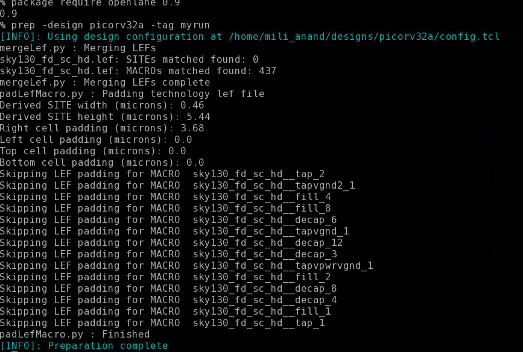
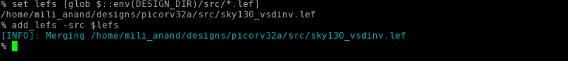

# OpenLANE
OpenLANE is an automated RTL2GDSII flow which comprises many other EDA tools out there, for eg. Yosys, OpenSTA, Netgen, Magic etc. The main idea of OpenLANE is to have a complete and clean RTL2GDSII flow without any human intervention. OpenLANE is tuned for Skywatrer 130nm opensource PDK and can be used to produce hard macros and chips.

## Introduction
OpenLANE ASIC flow has several steps. The flow starts with design RTL and ends with final layout in GSII format. Foe functioning it needs PDKs. OpenLANE is based on several opensource projects such as Magic, Yosys, qflow, Fault, openroad, abc and Klayout. Here is the ASIC flow.

* The flow starts with RTL sysnthesis. RTL is fed to *yosys* with some design constraints. *yosys* basically translates the RTL into a logic circuit using engineering components. This circuit is optimised and then mapped into cells using *abc*. *abc* has to be guided during the optimisation and that is done by abc script. OpenLANE comes with various abc scripts, we refer to them as synthesis strategies. We have strategies that target least area and we have strategies that targets best timings. Different design can use different strategies to implement different objectives and for that  we have synthesis exploration utility which shows how the design delay and area is effected by synthesis strategy. OpenLANE also has design exploration utility which can be used to sweep the design configurations and there are than 16 of them, and generate report of different design matrix and also show the number of violations generated after generating the layout. This is useful to find best coonfiguration for openLANE design.  
* After synthesis comes the testing structure i.e Design for test (DFT) insertion. If we want our design to be ready for testing we can enable this step which is optional. It uses opensource program *Fault*. It performs scan insertion, automatic test pattern generation, test patterns, fault coverage, fault simulation etc.
* Then comes the physical design implementation. It is called automated PnR ( Placement and Routing). It consists of several steps which is done by *Openroad* opeen source tool. These are floor/power planning, decoupling capacitor and tap cells insertion, placement, post placement optimisation, cts and routing, performed chronologically.
* As we perform optimization which involves some transformation of gate level netlist that was generated by the synthesis step. We need to perfomr Logic Equivalance Checking (LEC)
* and then this can be done by *yosys*. So we compare the netlist result from the optimization done during physical implementation to the gate level netlist formed during synthesis to make sure we are logically equivalance.
* During physical implementation we have a special step and this is antenna diode insertion script. This step is required to address the antenna rules violations. As when a wire segment is fabricated ans it is long enough it can act as an antenna. It collects charges which can damage transistor gate during fabrication. So legnth of the wire of these transistor gate must be limited usually this is the job of router.
* With openLANE we can take a preventive approach. In this we add a fake antenna diode next to every cell input after placement. This fake antenna diode is not real diode but follows the footprints of the library antenna diode. We run the antenna checker i.e *Magic* on the router layout and if the check reports violations on the cell input pin, replace the fake diode cell by a real one.
* The sign off of OpenLANE has steps like Static Timing Analysis (STA), Physical Verification, Design Rules Checking (DRC) and Layout vs Schematic (LVS). LVS is done by *Magic* and *Netgen*, extracted by SPICE by Magic vs Verilog netlist.

## DAY-1 
### Inception of opensource EDA tools, OpenLANE and Sky130 PDK
The day 1 started off with explanation of chip as a package and various MACROS inside the chip. Then we had a brief introduction to RISK-V Instruction Set Architecture (ISA) followed by detailed explanation on how software interacts with hardware. Later we were given introduction to all components of open-source digital ASIC design such as HDL, RTL, IP's of the function that we want to implement, EDA tools and process design kit. Then we were givem a simplified RTLIIGDS flow i.e synthesis,  floor and power planning, placement, clock tree synthesis, signal routing and static timing analysis. After that we were given introduction to openLANE and strive chipsets followed by detailed ASIC design flow. Then we had a tour of OpenLANE directory structure in detail.

#### Invoking openLANE in interactive mode

#### Performing intial preprations for picorv32a

#### Running synthesis

Use `run_synthesis` 

once the synthesis is complete you get the slack report of min and max paths of clock

## DAY-2
### Good floorplan vs bad floorplan and introduction to library cells
The day 2 started of with the concepts of defining width and height of core and die followed by explanation of utilisation factor i.e *ratio of area occupied by netlist and total area of the core* as well as aspect ratio which ratio of *height and width*. Explanation on preplaced cell was given which are basically macros and IP's that are implemented once (i.e placed only once on the chip) and can be instantiated multiple number of times onto a netlist. This has to be done before routing. The locations of preplace cells are fixed. We also surroundthese cells with decoupling to avoid crosstalk.
Then the concept of powerplanning was explained where we learnt the concept of ground bounce and also why we use a mesh like structure ( multiple power supply) for pwer supply.
And later the concepts of placement was given where we  learnt about netlist binding , cell design and characterization flow.

During the lab sessions we were given the method to make runs folder with a custom folder name which actually saves all the activities using command :

`prep -design picorv32a -tag <file_name>`

We can calso overwrite flag using :

`prep -design picorv32a -tag <file_name> -overwrite`

Before running the floorplan we observed the default floorplan config file, config.tcl and sky130A config file. The precedency of these files are **Sky130A config file> config.tcl> default floorplan config file**. Which means that any changes in **Sky130A config file** will overwrite the changes made in the other two. 
Then we fix the utilization factor, aspect ratio, the i/o pins and provide decap cells and welltap cells. To run the floorplan we use :

`run_floorplan`

#### Invoke the Magic tool to view the layout by proving lef, tech library and def file.

#### Layout

Here, we are doing condition related placement i.e we are not considering timing. Placement occurs in two stages 1) global 2) detailed. In global placement there is no legalisation of cell positions i.e cells are placed in floorplan in random manner. While in latter there is legalisation i.e it makes sure that cells are not overlapping. The main objective is to reduce wire legnth and in openLANE we use HPWL (Half parameter wire legnth) cencept which must reduce. Therefore we see many interations when we run placement. To run placement use 

`run_placement`

#### Invoke magic tool to view placement layout by providing lef, tech library and def file.

#### Layout

We notice that in openLANE power distribution flow is created post floorplan, placement and CTS. While in ASIC flow we observed that floor and power planning is done before placement.

## DAY-3

### Design library cell using Magic Layout and ngspice
The day 3 started of with the explanation on spice deck which basically gives the connectivity information, component values and how to identify nodes. We did static behavior evaluation of CMOS where we concluded that CMOS is a robust inverter. To plot the waveform on the we used ngspice. Following are steps for simulation on ngspice:
1. Source the .cir spice deck file
2. Run the spice file by: run
3. Run: setplot which allows you to view in plot possible on simulation deck
4. Select the simulation desired by entering the simulation name in the terminal 
5. Then run: display to see nodes available
6. Run: plot

We also had detailed explanation on 16 Mask CMOS process steps:
* Substrate selection
* Creating an active region for transistor
* Nwell and Pwell formation
* Creating gate terminal
* Lightly Doped Drain formation
* Source and Drain formation
* Creating contacts and local interconnections
* Higher level metal formation

#### LAB steps to create final SPICE deck using Sky130A
Clone https://github.com/nickson-jose/vsdstdcelldesign repo to get the cell files. This will give us the necessary .mag files

To run the Magic tool first we need to copy `sky130A.tech` files to `vsdstdcelldesign` using command:

Invoke Magic tool using SKY130A tech file and inverter mag file using command:

`magic -T sky130A.tech sky130.mag &`

#### Layout

#### Metal Layers

If we observe the layout the DRC error are 0. If we make any changes and create an error ( for eg. delete N-well) then the DRC tab will not be 0. And the errors will be reflected on tkon window of Magic tool. We can also select the area by moving the cursor and pressing 's' and type 'what' in the tkon window which will the info of the particular area selected.

#### Library characterisation
In library characterisation we identify four parameters which are rise transition delay, fall transition delay, rise cell delay and fall cell delay. To understand these parameters we consider the above layout and extract SPICE netlist.

#### Extracting SPICE Netlist

#### Extracted SPICE netlist 

#### Make these modifications

#### Invoke ngspice
`ngspice sky130_inv.spice`

#### The plot of output vs time
 Use command `plot y vs time a`
 
 
 
 We calculate the 4 parameters as part of library characterization:
 * Rise transition delay = Time taken for the output signal to reach from 20% of max value to 80% of max value.
 * Fall transition delat = Time taken for the output signal to reach from 80% of max value to 20% of max value.
 * Cell rise delay = Time difference between 50% of rising output and 50% of falling output
 * Cell fall delay = Time difference between 50% of falling output and 50% of rising output

#### Examples
Fall transition delay = 0.027ns

Cell fall delay= 0.043ns

Then we were given explanation on DRC rule. For more info https://skywater-pdk.readthedocs.io/en/latest/rules/periphery.html#m3

## DAY-4
### Pre-layout timing analysis and importance of good clock tree

The day 4 started with the objective to extract lef file and plug it into picrov32a that is to develop a lef file for std cell library. But before that we need to make sure our layout follows the two main requirements for PnR tool:
1. The i/p and o/p ports must lie on the intersection of vertical and horizontal tracks.
2. The width of the std cell must be odd multiple of horizontal track pitch and height must be odd multiple of vertical track pitch.

#### Grid in the layout

To undestand this we first need to convert the grid size in the Magic tool window to the track pitch size. For that we observe the `tracks.info` file.

Then we make some modification in grid structure.

#### Modified grid structure

After observing the grid structure we notice that above two requirements are met. We will define pin use and its attributes. We will save the layout by custom name `sky13_vsdinv.mag` 
Use command in tkon window:
`save sky130_vsdinv.mag`

Envoke the tech file and new mag file that we saved in the Magic tool. Convert the std cell layout to LEF file.

#### LEF file

This LEF file is then copied to picorv32a/src directory. Now we have to inclue the custom cell into openLANE flow and the first stage in the openLANE flow is synthesis. So for that we have to make sure that *abc* maps the netlist into the library. We nee dto have a library which has our cell deifinition for synthesis. These libraries are in `vsdstdcelldesign` lib directory. And we copy them to our picorv32a/src directory. These lib files are for different corner for different temperature and voltage values.

#### Reconfigure synthesis switches in config.tcl file

Then we will invoke openLane in interactive mode and prep prep design in overwrite.

Then before synthesis we will run the below commands. These are to include addition lef into the flow:

`set lefs [glob $::env(DESIGN_DIR)/src/*.lef]`

`add_lefs -src $lefs`

#### Run Synthesis

We observe that the slack is too high. So as to reduce it by making changes in some variables. We review our synthesis strategy and enable cell buffering.

#### Run synthesis again.

We observe that slack has been significantly reduced. 

Then we floorplan and placement and invoke the Magic tool. 

#### Layout

#### Custom cell

Then we copy `my_base` file from vsdstdcelldesign to picorv32a/src.

Now we need to make sure slack violation is reduced. This is done by static timing analysis.So we carry out this in a seperate tool which is openSTA. Before that we make a pre_sta.conf file

Then invoke openSTA by the file that we have created by command:
`sta pre_sta.conf`

#### Slack report after sta

We observe that the delay of this cell is large due to a high load capacitance due to high fanout. To fix this problem we can re-run synthesis within OpenLANE after reconfiguring the maximum fanout load value. We replace buffer cell recursively until slack is less than -1.

#### High fanout

#### Slack reports

Then we write this to verilog file. 

Then we run floorplan, placement and CTS.

`

